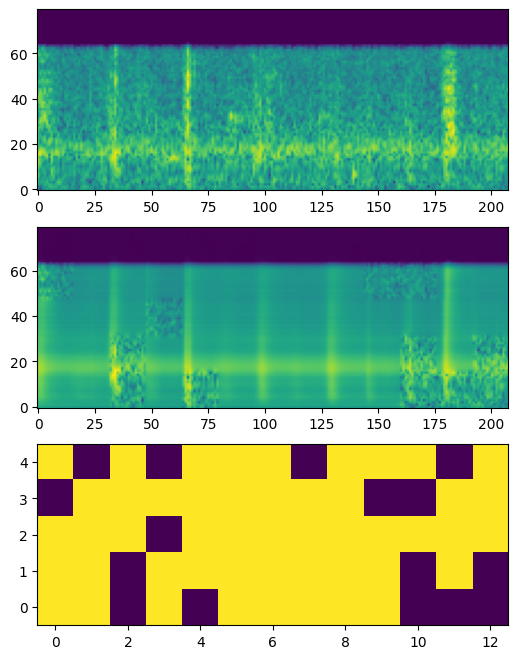
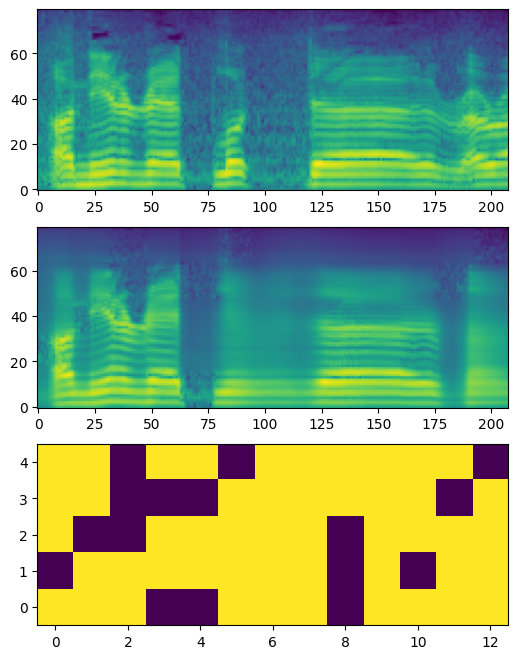
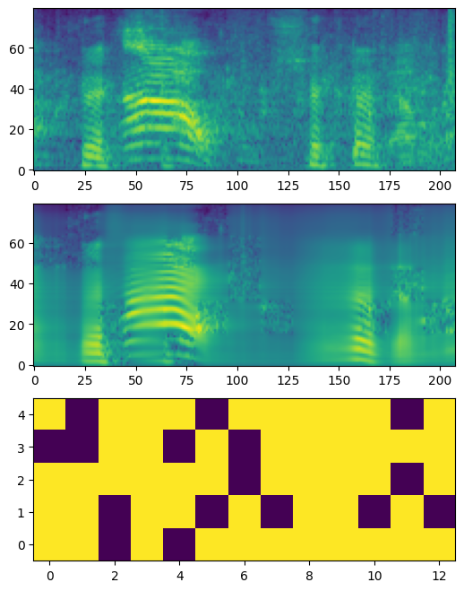
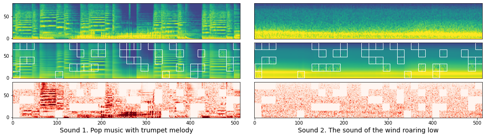
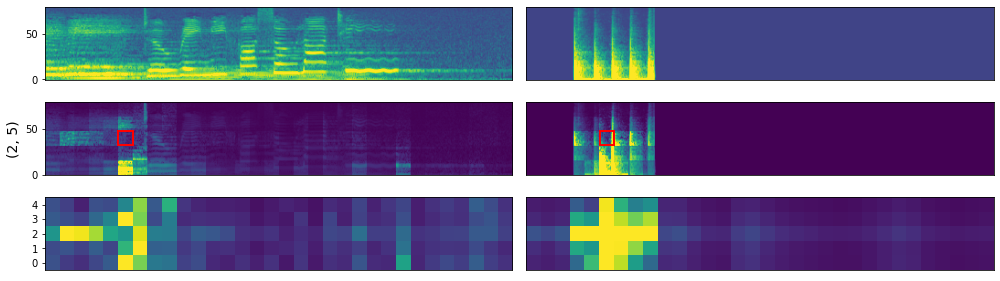

# Masked Spectrogram Modeling using Masked Autoencoders for Learning General-purpose Audio Representation

This is a demo implementation of Masked Spectrogram Modeling using Masked Autoencoders (MSM-MAE),
a self-supervised learning method for general-purpose audio representation, includes:

- Training code that can pre-train models with arbitrary audio files.
- Evaluation code to test models under two benchmarks, [HEAR 2021](https://arxiv.org/abs/2203.03022) and [EVAR](https://github.com/nttcslab/eval-audio-repr).
- Visualization examples and a notebook.
- Pre-trained weights.

If you find MSM-MAE useful in your research, please use the following BibTeX entry for citation.

```BibTeX
@InProceedings{niizumi2022masked,
    title     = {Masked Spectrogram Modeling using Masked Autoencoders for Learning General-purpose Audio Representation},
    author    = {Niizumi, Daisuke and Takeuchi, Daiki and Ohishi, Yasunori and Harada, Noboru and Kashino, Kunio},
    booktitle = {HEAR: Holistic Evaluation of Audio Representations (NeurIPS 2021 Competition)},
    pages     = {1--24},
    year      = {2022},
    editor    = {Turian, Joseph and Schuller, Björn W. and Herremans, Dorien and Kirchoff, Katrin and Perera, Paola Garcia and Esling, Philippe},
    volume    = {166},
    series    = {Proceedings of Machine Learning Research},
    month     = {13--14 Dec},
    publisher = {PMLR},
    pdf       = {https://proceedings.mlr.press/v166/niizumi22a/niizumi22a.pdf},
    url       = {https://proceedings.mlr.press/v166/niizumi22a.html}
}
```

### **New Method Notice (ICASSP2023)**

We propose a new method [Masked Modeling Duo (M2D)](https://github.com/nttcslab/m2d), in the coming [ICASSP2023](https://2023.ieeeicassp.org/). Please check it out if you are looking for a more performing model. M2D is different from MSM-MAE with regard to the followings:

- M2D does not employ the reconstruction task, which calculates the loss in input space; instead, it calculates the loss in the feature space, using a momentum encoder to encode masked patches into features.
- M2D performs better than MSM-MAE.

In short, if you want a better audio representation, please try M2D. If you want to try masked reconstruction, MSM-MAE is for you.

*** [Link to the repository of the Masked Modeling Duo (M2D)](https://github.com/nttcslab/m2d) ***

### History

- UPDATE (Apr, 2023): [Masked Modeling Duo (M2D)](https://github.com/nttcslab/m2d) is linked to this repository.
- UPDATE (Jan, 2023): [PMLR paper](https://proceedings.mlr.press/v166/niizumi22a.html) is out. Replaced BibTeX and URL links with the PMLR website. Also fixed [a bug](https://github.com/nttcslab/msm-mae/issues/2).
- UPDATE (Dec, 2022): Added [Vizualization & Audio example notebook](misc/Note_viz_and_play_reconstruction.ipynb). Now we can listen 👂 to how the reconstruction results sound!? 
- UPDATE (Nov, 2022): Extended runtime inference `'encode_lms()'` to output features for each layer.

## 1. Getting Started

The repository relies on the codes from [facebookresearch/mae](https://github.com/facebookresearch/mae), and we patch our changes on these files.

1. Download external source files from [facebookresearch/mae](https://github.com/facebookresearch/mae), and apply a patches.

```sh
curl -o util/lars.py https://raw.githubusercontent.com/facebookresearch/mae/6a2ba402291005b003a70e99f7c87d1a2c376b0d/util/lars.py
curl -o util/lr_decay.py https://raw.githubusercontent.com/facebookresearch/mae/6a2ba402291005b003a70e99f7c87d1a2c376b0d/util/lr_decay.py
curl -o util/lr_sched.py https://raw.githubusercontent.com/facebookresearch/mae/6a2ba402291005b003a70e99f7c87d1a2c376b0d/util/lr_sched.py
curl -o util/misc.py https://raw.githubusercontent.com/facebookresearch/mae/6a2ba402291005b003a70e99f7c87d1a2c376b0d/util/misc.py
curl -o msm_mae/pos_embed.py https://raw.githubusercontent.com/facebookresearch/mae/6a2ba402291005b003a70e99f7c87d1a2c376b0d/util/pos_embed.py
curl -o main_pretrain.py https://raw.githubusercontent.com/facebookresearch/mae/6a2ba402291005b003a70e99f7c87d1a2c376b0d/main_pretrain.py
curl -o msm_mae/engine_pretrain.py https://raw.githubusercontent.com/facebookresearch/mae/6a2ba402291005b003a70e99f7c87d1a2c376b0d/engine_pretrain.py
curl -o msm_mae/models_mae.py https://raw.githubusercontent.com/facebookresearch/mae/6a2ba402291005b003a70e99f7c87d1a2c376b0d/models_mae.py
cd msm_mae
patch -p1 < patch_msm_mae.diff
cd ..
patch -p1 < patch_main.diff
```

2. If you need a clean environment, the following [anaconda](https://www.anaconda.com/products/distribution) example creates a new environment named `ar`:

```sh
conda create -n ar python==3.8
conda activate ar
```

3. Install external modules listed on [requirements.txt](requirements.txt).

### 1-1. Quick example

We have a utility runtime model, RuntimeMAE, which helps you to load a pre-trained model and encode your audios.

```python
from msm_mae.runtime import RuntimeMAE

device = torch.device('cuda')

# Prepare your batch of audios. This is a dummy  example of three 10s  waves.
batch_audio = 2 * torch.rand((3, 10 * 16000)) - 1.0 # input range = [-1., 1]
batch_audio = batch_audio.to(device)

# Create a model with pretrained weights.
runtime = RuntimeMAE(weight_file='80x512p16x16_paper/checkpoint-100.pth')
runtime = runtime.to(device)

# Encode raw audio into features. `encode()` will process automatically:
# 1. Convert the input `batch_audio` to log-mel spectrograms (LMS).
# 2. Normalize the batch LMS with mean and std calculated from the batch.
# 3. Encode to feature.
frame_level = runtime.encode(batch_audio)

# This example ends up with frame-level 3840-d feature vectors for 63 time frames.
# The `frame_level` will have a size of torch.Size([3, 63, 3840]).
print(frame_level.shape)

#  You can get clip-level features by taking average of time franes.
# The `clip_level` will have a size of torch.Size([3, 3840])
clip_level = torch.mean(frame_level, dim=1)
print(clip_level.shape)
```

To get the best features, you can normalize your audio with normalization statistics of your entire input data and use them in your pipeline.

```python
# Calculate statistics in advance. This is an example with 10 random waves.
means, stds = [], []
for _ in range(10):
    lms = runtime.to_feature(torch.rand((10 * 16000)).to(device))
    means.append(lms.mean())
    stds.append(lms.std())
dataset_mean, dataset_std = torch.mean(torch.stack(means)), torch.mean(torch.stack(stds))
# These can be numbers [-5.4919195, 5.0389895], for example.

# The followings are an example pipeline.

# Convert your batch audios into LMS.
batch_lms = runtime.to_feature(batch_audio)
# Normalize them.
batch_lms = (batch_lms - dataset_mean) / (dataset_std + torch.finfo().eps)
# Encode them to feame-level features.
frame_level = model.encode_lms(batch_lms)
#  Calculate clip-level features if needed.
clip_level = torch.mean(frame_level, dim=1)
```

To get features per layer, you can add `return_layers=True`.

```python
# Getting features per layer.
y = rt.encode_lms(torch.rand(10, 1, 80, 900), return_layers=True)
print(len(y), y[0].shape)
# --> 12 torch.Size([10, 57, 3840])

# As normal, getting finale-layer features.
y = rt.encode_lms(torch.rand(10, 1, 80, 900), return_layers=False)
print(y.shape)
# --> torch.Size([10, 57, 3840])
```

## 2. Evaluating MSM-MAE

### 2-1. Evaluating on HEAR 2021 NeurIPS Challenge Tasks

We evaluate our models on [our paper](https://proceedings.mlr.press/v166/niizumi22a.html) using [hear-eval-kit](https://github.com/neuralaudio/hear-eval-kit) from on [HEAR 2021 NeurIPS Challenge](https://arxiv.org/abs/2203.03022) as follows.

NOTE: The folder `hear` has all the files we need to evaluate models on hear-eval-kit.

1. Install hear-eval-kit as follows:

    ```sh
    pip install heareval
    ```

2. Download your copy of downstream dataset for 16 kHz. See [HEAR NeurIPS 2021 Datasets@zenodo](https://zenodo.org/record/5885750#.YoRfYvPP1zV) for the detail.

3. To evaluate our models, we need a local package which loads and runs our models. The followings shows an example for a model named `80x208p16x16_mymodel`.

    ```sh
    cd hear/hear_msm
    cp sample.py 80x208p16x16_mymodel.py
    ** Edit the 80x208p16x16_mymodel.py here, so that the value of `model_path` points to your model with an absolute path. **
    cd ..
    pip install -e .
    ```

4. We are on the folder `hear`. Run the [hear-eval-kit](https://github.com/neuralaudio/hear-eval-kit) with your pre-trained model.

    ```sh
    python -m heareval.embeddings.runner hear_msm.80x208p16x16_mymodel --tasks-dir /your_copy/hear/tasks
    CUBLAS_WORKSPACE_CONFIG=:4096:8 python -m heareval.predictions.runner embeddings/hear_msm.80x208p16x16_mymodel/*
    ```

### 2-2. Evaluating on EVAR

[EVAR](https://github.com/nttcslab/eval-audio-repr) is an evaluation package for audio representations used by our research papers such as [BYOL-A](https://arxiv.org/abs/2103.06695) and [Composing General Audio Representation by Fusing Multilayer Features of a Pre-trained Model](https://arxiv.org/abs/2205.08138).
It supports the following downstream tasks: ESC-50, US8K, FSD50K, SPCV1/V2, VoxForge, VoxCeleb1, CREMA-D, GTZAN, NSynth instrument family, Pitch Audio Dataset (Surge synthesizer).

The following steps setup MSM-MAE on the EVAR.

1. Clone EVAR repository and prepare basic items.

    ```sh
    git clone https://github.com/nttcslab/eval-audio-repr.git evar
    cd evar
    curl https://raw.githubusercontent.com/daisukelab/general-learning/master/MLP/torch_mlp_clf2.py -o evar/utils/torch_mlp_clf2.py
    curl https://raw.githubusercontent.com/daisukelab/sound-clf-pytorch/master/for_evar/sampler.py -o evar/sampler.py
    curl https://raw.githubusercontent.com/daisukelab/sound-clf-pytorch/master/for_evar/cnn14_decoupled.py -o evar/cnn14_decoupled.py
    cd ..
    ```

2. Install MSM-MAE files on the cloned `evar` folder.

    ```sh
    ln -s ../../to_evar/ar_msm_mae.py evar/evar
    ln -s ../../to_evar/msm_mae.yaml evar/config
    cd evar
    sed 's/import evar\.ar_byola/import evar\.ar_byola, evar\.ar_msm_mae/' -i lineareval.py
    cd ..
    ```

3. Setup downstream task datasets according to [Preparing-datasets.md](https://github.com/nttcslab/eval-audio-repr/blob/main/Preparing-datasets.md). The following is an example for setting up CREMA-D dataset.

    ```sh
    cd evar
    python evar/utils/download_cremad.py downloads/cremad
    python prepare_wav.py downloads/cremad work/16k/cremad 16000
    cd ..
    ```

Once setup is complete, you can evaluate your models as follows.

- For evaluating a model with an absolute path `/your/path/to/model.pth`.

    ```sh
    cd evar
    python lineareval.py config/msm_mae.yaml cremad weight_file=/your/path/to/model.pth
    ```

- If you want to save GPU memory, set a fewer batch size as follows. This example sets it as 16.

    ```sh
    cd evar
    python lineareval.py config/msm_mae.yaml cremad batch_size=16,weight_file=/your/path/to/model.pth
    ```

## 3. Training From Scratch

First, you need to prepare pre-training data samples; then, you can pre-train your model.
The following is an example to pre-train a model on [FSD50K](https://arxiv.org/abs/2010.00475) dataset.

1. Preprocess .wav files into log-mel spectrogram .npy files. The following converts from a source folder `/your/local/fsd50k/FSD50K.dev_audio` to a new folder `lms_fsd50kdev`.

    ```sh
    python wav_to_lms.py /your/local/fsd50k/FSD50K.dev_audio lms_fsd50kdev
    ```

2. Create a CSV file which is used as a list of pre-training samples containing a single column `file_name`. The following example creates `trainingfiles.csv`.

    ```sh
    echo file_name > trainingfiles.csv
    (cd lms_fsd50kdev && find . -name "*.npy") >> trainingfiles.csv
    ```

3. Make some copies of samples for visualization. The following example makes 3 symbolic links. All the samples under the folder `vis_samples` will be used to visualize reconstruction results of a checkpoint during training.

    ```sh
    mkdir -p lms_fsd50kdev/vis_samples
    ln -s ../1240.npy lms_fsd50kdev/vis_samples/1240.npy
    ln -s ../106237.npy lms_fsd50kdev/vis_samples/106237.npy
    ln -s ../119949.npy lms_fsd50kdev/vis_samples/119949.npy
    ```

4. Once your data is ready, start pre-training as follows.

    ```sh
    python main_pretrain.py 80x208p16x16_your_test --input_size 80x208 --data_path lms_fsd50kdev --dataset trainingfiles --model=mae_vit_base_patch16x16
    ```

### 3-1. About run folders

The training loop creates a folder called the `run folder` to store artifacts of your training run, such as a log, visualizations, and checkpoints.
In the example above, the `80x208p16x16_your_test` is the run folder name which has a format below:

    <input_size>p<patch_size>_<your_free_string>
     - input_size: Two integers concatenated with `x`.
     - patch_size: Two integers concatenated with `x`.
     - your_free_string: Optional.

**NOTE: When a model is evaluated by EVAR or hear-eval-kit, the input and patch size parameters written in the run name are used.**

### 3-2. Evalidation during training

The training loop takes two actions for evaluating checkpoints during training: visualization and calling an external command `quick_eval.sh` (EVAR by default).

- While training, `main_pretrain.py` will call a script named `quick_eval.sh` for every 20 epochs by default. You can edit `quick_eval.sh` for your purpose.

- The training loop also visualizes reconstruction results using checkpoints. You can find them under the sub-folder of the run folder, such as `80x208p16x16_tttt/19`. The folder contains raw results in .npy and image files in .png as the following examples.

    <table><tbody><tr>
    <td></td>
    <td></td>
    <td></td>
    </tr></tbody></table>


## 4. Visualization & Audio Examples

👉 [Visualization example notebook](misc/Note_visualization.ipynb) and [Vizualization & Audio example notebook](misc/Note_viz_and_play_reconstruction.ipynb) are available. 👈

The [Visualization example notebook](misc/Note_visualization.ipynb) shows how to visualize reconstruction results as well as attention maps.

- Download `AudioSetWav16k_examples.zip` that contains example wave samples from the [releases](https://github.com/nttcslab/msm-mae/releases) and unzip the zip file in the `misc` folder beforehand.

Here are reconstruction examples:



Here are attention map examples:



In addition, [Vizualization & Audio example notebook](misc/Note_viz_and_play_reconstruction.ipynb) shows how we can invert these log-mel spectrograms to audios using [librosa.feature.inverse.mel_to_audio](https://librosa.org/doc/main/generated/librosa.feature.inverse.mel_to_audio.html). Two examples from the notebook follow:

- 📣 [Sound1 Input](misc/Sound1-input.wav) → 📣 [Reconstruction](misc/Sound1-recon.wav)
- 📣 [Sound2 Input](misc/Sound2-input.wav) → 📣 [Reconstruction](misc/Sound2-recon.wav)


## 5. Pre-trainede Weights and Network Structure Details

Three pre-trained weights are published on the [releases](https://github.com/nttcslab/msm-mae/releases),
and the followings are their EVAR task results:

| weight             | esc50   | us8k   | spcv2   | vc1   | voxforge   | cremad   | gtzan   | nsynth   | surge   |
|:-------------------|:--------|:-------|:--------|:------|:-----------|:---------|:--------|:---------|:--------|
| 80x512p16x16_paper | 89.1%   | 84.3%  | 93.1%   | 56.1% | 97.5%      | 70.1%    | 79.3%   | 76.9%    | 37.5%   |
| 80x512p16x16_0425  | 88.9%   | 84.0%  | 92.4%   | 56.5% | 96.8%      | 67.6%    | 81.4%   | 76.1%    | 37.4%   |
| 80x208p16x16_0422  | 87.1%   | 82.2%  | 91.1%   | 49.7% | 95.6%      | 66.9%    | 75.9%   | 76.5%    | 37.8%   |

- 80x512p16x16_paper: This weight is the pre-trained weight used to calculate the numbers in the paper, trained on our old unpolished code. **Cannot be used for visualizations** due to a minor difference in the decoder structure.
- 80x512p16x16_0425: This weight is a pre-trained weight that is trained with the current code to check reproducibility.
- 80x208p16x16_0422: This weight is a pre-trained weight that is trained with the current code to check reproducibility.

**FYI:** You can check [a notebook](misc/Note_calc_evar_score.ipynb) that summarizes EVAR task results.

### 5-1. Network Structure Details

Our ViT network implementation has three minor differences from the original MAE implementation, due to historical reason. (We have already been testing based on [pengzhiliang/MAE-pytorch](https://github.com/pengzhiliang/MAE-pytorch) in late 2021, before the MAE implementation became available.)

- Our implementation follows [BEiT](https://github.com/microsoft/unilm/tree/master/beit), where the k bias is always zero in the Attention calculation. Though [it is explained to be equivalent in terms of calculation results](https://github.com/microsoft/unilm/issues/510), we keep this implementation in our network for better reproducibility.
- `[CLS]` token is removable by the option `--no_cls_token`.
- The decoder uses 1d positional embedding. You can switch to the 2d version by the option `--dec_pos_2d`.


## 6. License

See [LICENSE](LICENSE) for details.

## Acknowledgements

- Our code is based on the [MAE PyTorch/GPU re-implementation](https://github.com/facebookresearch/mae) of the paper [Masked Autoencoders Are Scalable Vision Learners](https://arxiv.org/abs/2111.06377).
- We also refer to another implementation of MAE, [pengzhiliang/MAE-pytorch](https://github.com/pengzhiliang/MAE-pytorch).
- We use [nnAudio](https://arxiv.org/abs/1912.12055) ([KinWaiCheuk/nnAudio](https://github.com/KinWaiCheuk/nnAudio)) for converting raw audio into log-mel spectrogram.

We appreciate these publicly available implementations and all the modules our experiments heavily depend on!

## References

- MAE: *[Kaiming He, Xinlei Chen, Saining Xie, Yanghao Li, Piotr Dollár, and Ross Girshick "Masked Autoencoders Are Scalable Vision Learners," 2021](https://arxiv.org/abs/2111.06377).*
- MSM-MAE: *[Daisuke Niizumi, Daiki Takeuchi, Yasunori Ohishi, Noboru Harada, and Kunio Kashino "Masked Spectrogram Modeling using Masked Autoencoders for Learning General-purpose Audio Representation," 2022](https://proceedings.mlr.press/v166/niizumi22a.html), [(arxiv)](https://arxiv.org/abs/2204.12260).*
- BEiT: *[Hangbo Bao, Li Dong, and Furu Wei "BEiT: BERT Pre-Training of Image Transformers," 2021](https://arxiv.org/abs/2106.08254).*
- HEAR 2021: *[Joseph Turian, Jordie Shier, Humair Raj Khan, Bhiksha Raj, Björn W. Schuller, Christian J. Steinmetz, Colin Malloy, George Tzanetakis, Gissel Velarde, Kirk McNally, Max Henry, Nicolas Pinto, Camille Noufi, Christian Clough, Dorien Herremans, Eduardo Fonseca, Jesse Engel, Justin Salamon, Philippe Esling, Pranay Manocha, Shinji Watanabe, Zeyu Jin, and Yonatan Bisk "HEAR 2021: Holistic Evaluation of Audio Representations," 2022](https://proceedings.mlr.press/v176/turian22a.html), [(arxiv)](https://arxiv.org/abs/2203.03022).*
- FSD50K: *[Eduardo Fonseca and Xavier Favory and Jordi Pons and Frederic Font and Xavier Serra, “FSD50K: an Open Dataset of Human-Labeled Sound Events,” 2020](https://arxiv.org/abs/2010.00475).*
